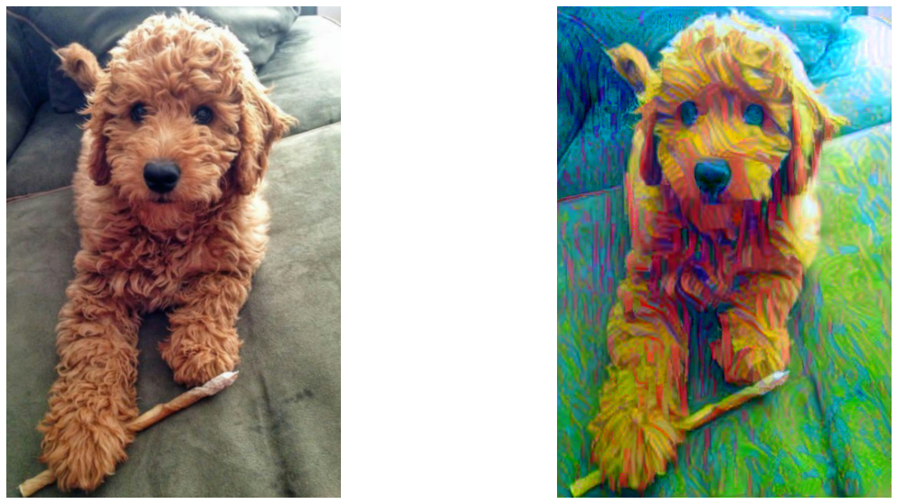

## Lesson 6 - Style Transfer 

This lesson was all about Style Transfer, where basically you have: 
 - Trained CNN
 - Content Image 
 - Style Image 

And you will generate a Target image, product of applying Style to your content image. 

In general, this is done by performing the following steps: 

**Feature Extraction**
- On the Conv Layers, extract complex patterns and features
- Use Maxpooling to discard the spatial info.
- Generate the feature representation by extrating info about the content 

**What about Style??**

Style is represented by all the characteristics related to Texture,Color and Curvature. 

**How is style isolated?**

 There is a feature space that is designed for Capturing the characteristics mentioned above ( color, texture ...)

 Then it will extract by similarities, for example: common colours and shapes. 

 It should leave out all the information about the object ( spatial representation )

 **How do we know when the target image is good??**

 1. Calculate the content loss, by looking for correlation between features of the layers in the trained model
 2. Calculate the style loss, correlations on each layer related to style, this is given by calculating a GRAM matrix and taking the difference between the style representation and the target image. 
 3. Finally, we add both losses, backpropagate, change the target image until we get a similar image to the one we are looking for. 

Notebooks: 

- [Learn how to apply style transfer](#Style_Transfer_Exercise.ipynb): using a VGG-19 network and 2 images of your preference. 
    

Resources: 
 - [Image Style Transfer Using Convolutional Neural Networks](https://www.cv-foundation.org/openaccess/content_cvpr_2016/papers/Gatys_Image_Style_Transfer_CVPR_2016_paper.pdf)
 - [Very Deep Convolutional Networks for Large-Scale Image Recognition ](https://arxiv.org/pdf/1409.1556.pdf)
 - [Gram Matrix](https://en.wikipedia.org/wiki/Gramian_matrix)

 ## RESULT OF STYLE TRANSFER

 