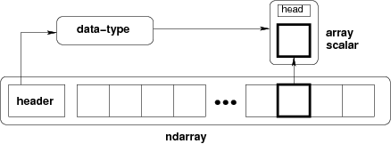

## Lesson 5 Matrix Math and Numpy Refresher

This lesson was about Numpy and its main data structure along with the main operations you can carry. 

**Numpy provides**: 

- Fast alternatives to math operations in Python. 
- Work efficiently with groups of numbers, like matrices.

Resource: checkout the [numpy reference](https://docs.scipy.org/doc/numpy/reference/)

### Data types notes

*Numpy* has one important data type called: **ndarray**, which is no more than a container or collection of items of the same type. 

All the items on the ndrarray take the same size of block in memory and all the blocks are interpreted in the same way. 

Extrating an item from an ndarray: 
- let's say you are searching by an index.

    The way this item in represented is by a Python object of type :*array scalar types* built in into Numpy.

    Array scalars works nicely with complex arrangments of data. 

    This is how an ndarray representation looks like [[1](#References)]

     

    As you can observe there is a header than contains an array scalar with information about the data types of your items, along with the items itself

### Ndarrays highlights 

- Like a python list, but not quite :) , as items inside the array **must be** of same type.
- Support fast maths operations
- Supports scalar, vectors (1-D), matrices (2-D) and tensors (N-D) 
- It has 3 kinds of [indexing](https://docs.scipy.org/doc/numpy/reference/arrays.indexing.html#arrays-indexing):
    1. Field access 
    2. Basic Slicing 
    3. Advanced indexing 

#### Indexing highlights

- Negatives indexes count from the end of the array. 

Example: 

``` 
>>> x = np.array([0, 1, 2, 3, 4, 5, 6, 7, 8, 9])
>>> x[-2:]

output: array([8, 9])
```

- Numpy creates a view, instead of a copy. All arrays generated by basic indexing are a view of the original. Meaning the following is really important then talking about memory.  

    >...when extracting a small portion from a large array which becomes useless after the extraction, because the small portion extracted contains a reference to the large original array whose memory will not be released until all arrays derived from it are garbage-collected. In such cases an explicit copy() is recommended.


#### References 

[[1]](https://docs.scipy.org/doc/numpy/reference/arrays.html) Array objects - Numpy Reference
